# Wanderlust – Full DevSecOps CI/CD Pipeline & Kubernetes Deployment

> End-to-end DevSecOps implementation on a three-tier MERN stack application — featuring dual CI pipelines, automated security scanning, GitOps-driven deployment, and cloud infrastructure provisioned with Terraform.

---

## 📌 Project Overview

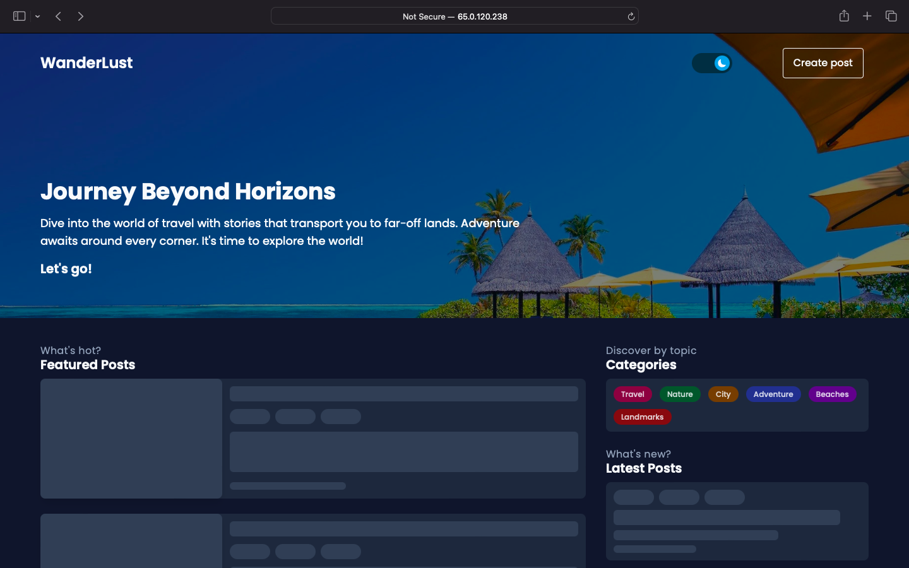

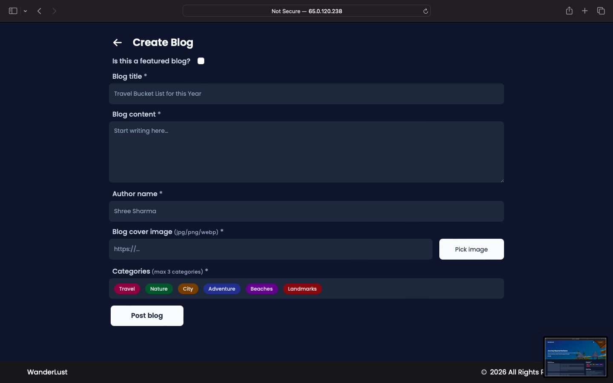

This project demonstrates a production-grade DevSecOps workflow built around the Wanderlust travel blog application. The focus is entirely on the **infrastructure, automation, and security pipeline** — not the application code itself.

The pipeline automatically builds, scans, tests, and deploys the application to a Kubernetes cluster on AWS, triggered by every code commit — with zero manual intervention after setup.

---

## 🏗️ Architecture

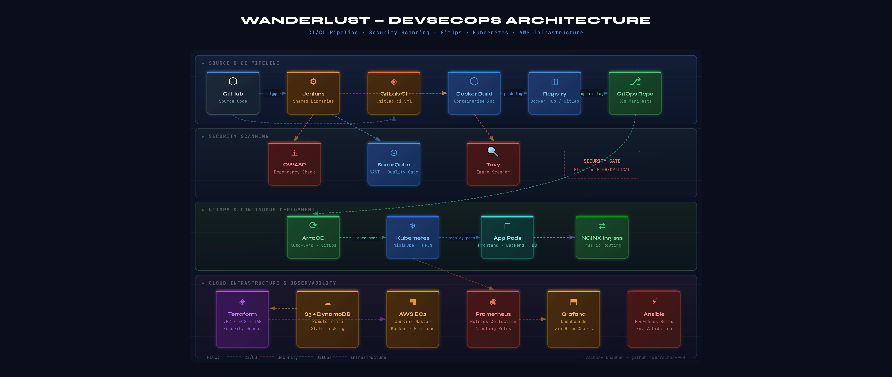

---

## ⚙️ Tech Stack

| Category | Tools |
|---|---|
| Source Control | Git, GitHub |
| CI Pipelines | Jenkins (Shared Libraries), GitLab CI |
| Containerisation | Docker, Docker Compose |
| Image Registry | DockerHub / GitLab Container Registry |
| Security Scanning | Trivy (container images), OWASP Dependency Check |
| Code Quality | SonarQube (SAST) |
| GitOps / CD | ArgoCD |
| Container Orchestration | Kubernetes, Helm, Minikube |
| Cloud Infrastructure | AWS (EC2, S3, VPC, IAM, DynamoDB) |
| Infrastructure as Code | Terraform (Remote State + State Locking) |
| Monitoring | Prometheus, Grafana (via Helm) |

---

## 🔁 Pipeline Flow

### CI Pipeline (Jenkins / GitLab CI)
```
Code Commit
    │
    ▼
Checkout Code
    │
    ▼
OWASP Dependency Check   ←── blocks on critical CVEs
    │
    ▼
SonarQube SAST Analysis  ←── quality gate enforced
    │
    ▼
Docker Build
    │
    ▼
Trivy Image Scan         ←── blocks on HIGH/CRITICAL vulns
    │
    ▼
Push to Registry
    │
    ▼
Update GitOps Manifest (image tag)
```

### CD Pipeline (ArgoCD)
```
Manifest Change Detected
    │
    ▼
ArgoCD Auto-Sync
    │
    ▼
Deploy to Kubernetes (rolling update)
    │
    ▼
Health Check / Rollback if failed
```

---

## ☁️ AWS Infrastructure (Terraform)

Infrastructure is fully provisioned via Terraform with:
- **Remote State** stored in S3 for team-safe state management
- **State Locking** via DynamoDB to prevent concurrent modifications
- Resources provisioned: VPC, public/private subnets, EC2 instances, IAM roles, Security Groups

```bash
# Initialise with remote backend
terraform init

# Preview changes
terraform plan

# Apply infrastructure
terraform apply
```

> 📁 See [`/Terraform`](./Terraform) for all configuration files.

---

## 📁 Repository Structure

```
wanderlust-devsecops/
├── Terraform/              # AWS infrastructure as code
│   ├── main.tf
│   ├── variables.tf
│   └── backend.tf          # S3 remote state config
├── kubernetes/             # K8s deployment manifests
│   ├── deployment.yaml
│   ├── service.yaml
│   └── ingress.yaml
├── GitOps/                 # ArgoCD application manifests
├── Automations/            # Ansible playbooks / helper scripts
├── Jenkinsfile             # Jenkins declarative pipeline
├── .gitlab-ci.yml          # GitLab CI pipeline
├── docker-compose.yml      # Local development setup
└── sonar-project.properties
```

---

## 🔒 Security Implementation

- **Trivy** scans every Docker image before it is pushed to the registry. Builds with HIGH or CRITICAL vulnerabilities are blocked.
- **OWASP Dependency Check** scans all third-party dependencies for known CVEs at build time.
- **SonarQube** acts as a mandatory quality gate — builds cannot proceed if code quality thresholds are not met.

---

## 🚀 How to Run This Project

### Prerequisites
- AWS account with IAM user (access key + secret)
- Jenkins server (or GitLab account)
- kubectl + Helm installed
- Terraform >= 1.0
- Docker

### Step 1 — Provision Infrastructure
```bash
cd Terraform
terraform init
terraform plan
terraform apply
```

### Step 2 — Configure Jenkins
> **[Add your specific Jenkins setup steps here — e.g., which plugins you installed, how you configured credentials, how you set up the shared library]**

### Step 3 — Configure SonarQube
```bash
docker run -d --name sonarqube -p 9000:9000 sonarqube:lts-community
# Access at http://<your-ip>:9000
# Default credentials: admin / admin
```

### Step 4 — Set Up ArgoCD
```bash
kubectl create namespace argocd
kubectl apply -n argocd -f https://raw.githubusercontent.com/argoproj/argo-cd/stable/manifests/install.yaml
kubectl patch svc argocd-server -n argocd -p '{"spec": {"type": "NodePort"}}'
```

### Step 5 — Run the Pipeline
Push a commit to trigger the CI pipeline. ArgoCD will automatically sync the deployment once the image tag is updated.

---

## 📸 Screenshots
- Gitlab Ci Pipeline
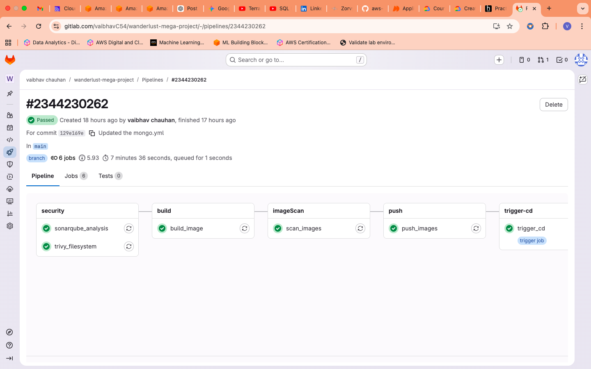

- Gitlab Repo
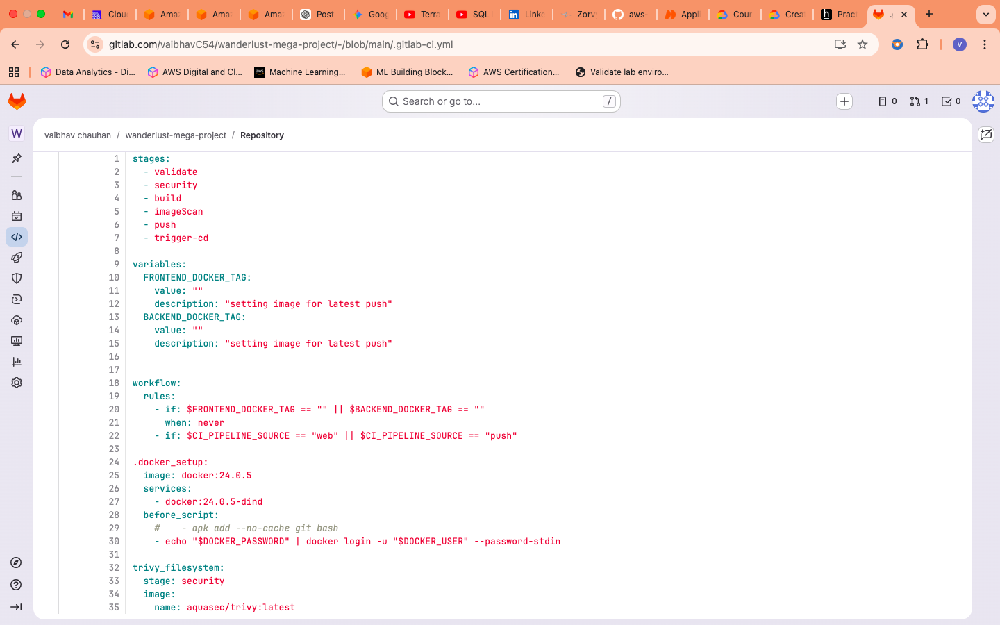

- Terraform statelocking
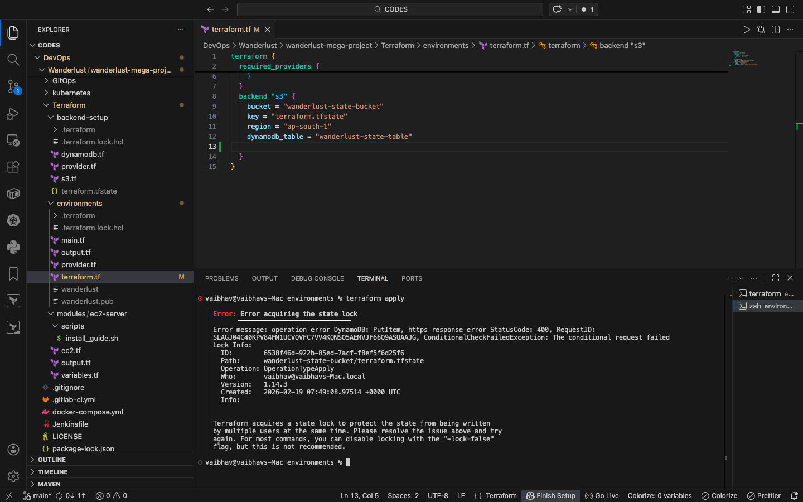

- Terraform plan
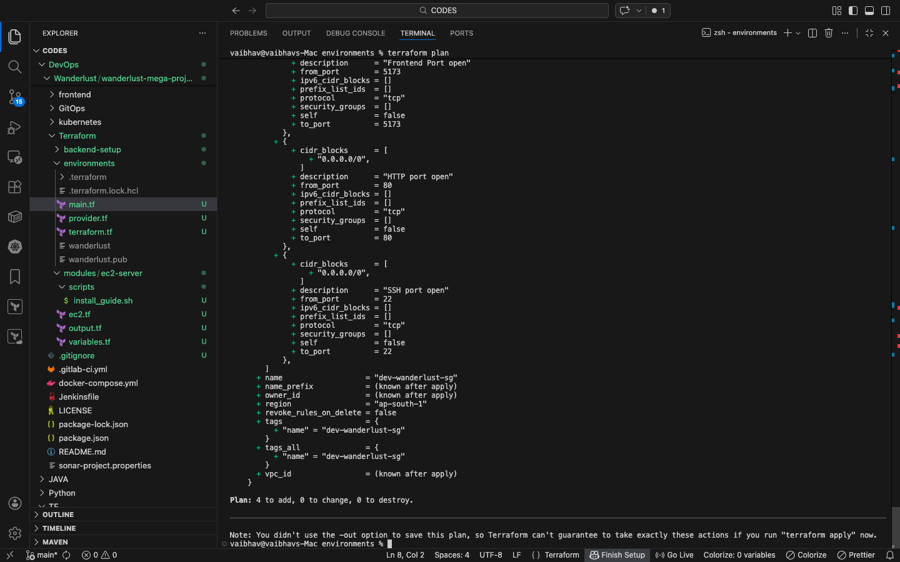

- Terraform Apply
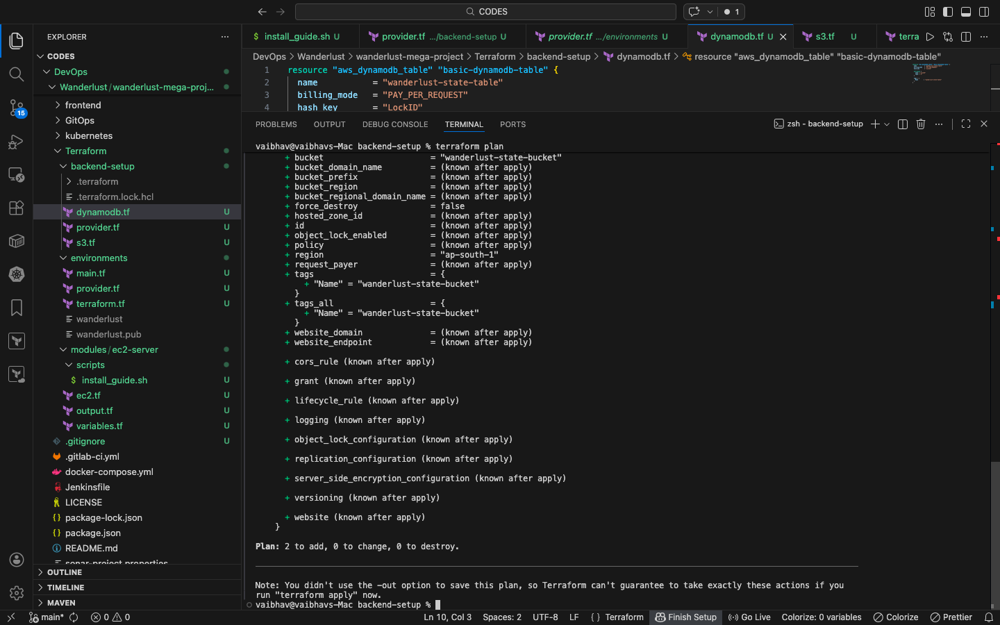

- Kubernetes Pods
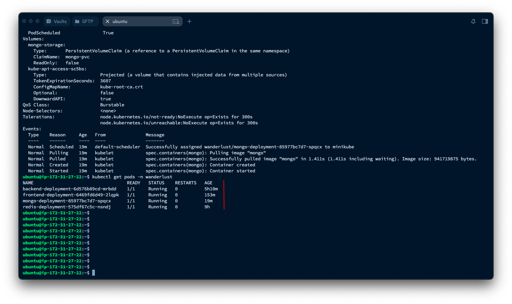

- ArgoCD 
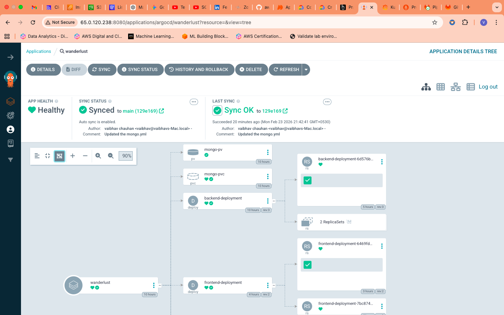

- Prometheus Dashbord
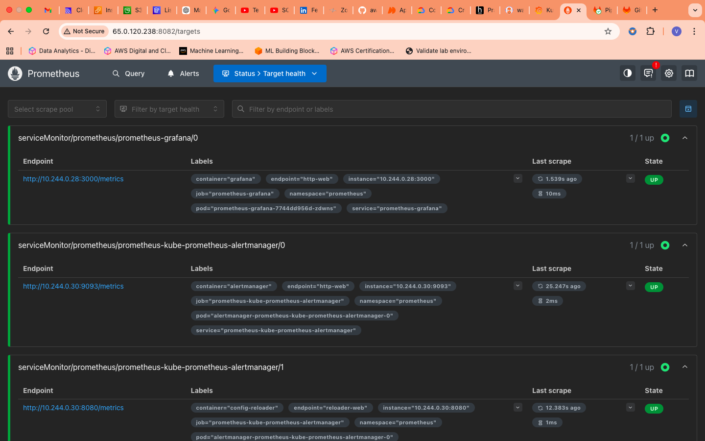

- Grafana Dashboard
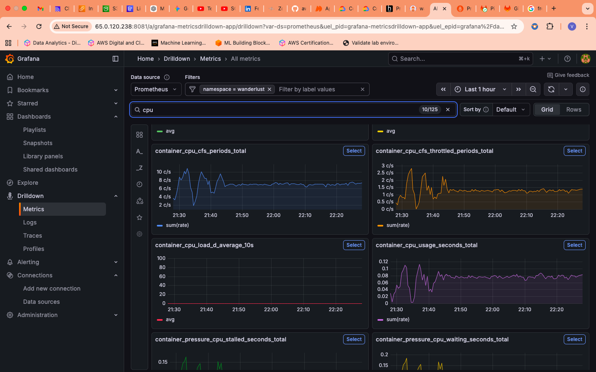


---

## 📌 Key Learnings & Decisions

- Used **Jenkins Shared Libraries** to avoid duplicating pipeline logic across Jenkinsfiles — all reusable stages (build, scan, push) live in a separate library repo ([`Shared_Jenkins_Lib`](https://github.com/Vaibhav040/Shared_Jenkins_Lib))
- Chose **ArgoCD over Jenkins CD** for the deployment step to separate concerns — CI handles build/test/push, ArgoCD handles cluster state
- Used **Minikube on EC2** instead of EKS to keep costs to zero while demonstrating production-equivalent deployment patterns

---

## 🔗 Related Repositories

- [Shared Jenkins Library](https://github.com/Vaibhav040/Shared_Jenkins_Lib)

---

**Vaibhav Chauhan**
[LinkedIn](https://www.linkedin.com/in/vaibhav-chauhan-eng) · [GitHub](https://github.com/Vaibhav040)
